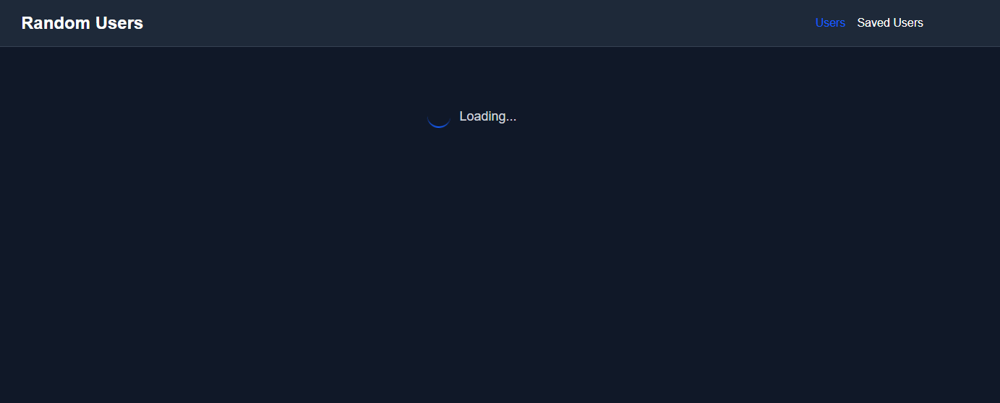
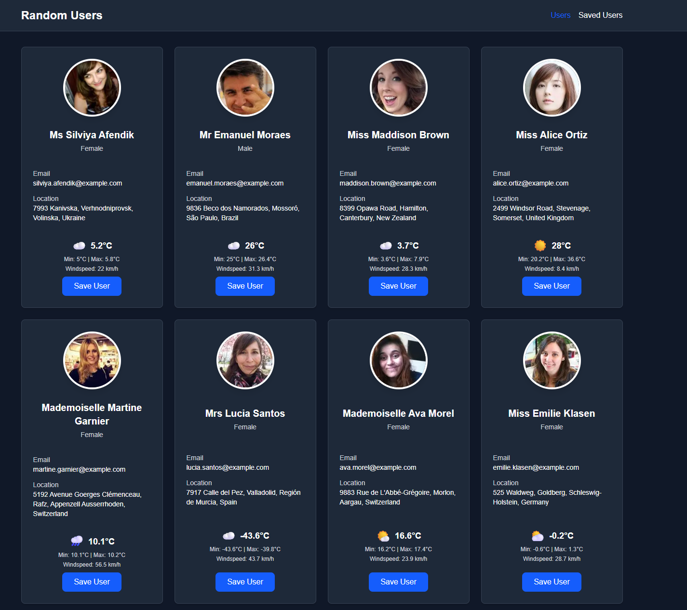
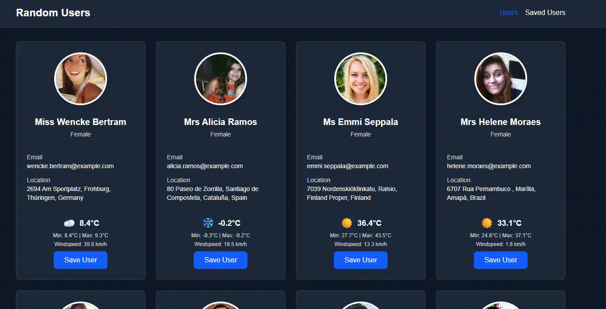

# This is Software Test Task

## Author: Nikita Afanasiev

## Current deployments:
Front-End: https://tis-test-task.vercel.app
Back-End: https://tis-test-task.onrender.com

## Main goals

1. Realize the full-stack application with Next.js + Nest.js in monorepo architecture.
2. Implement the API integration, which fetch users and weather from external API.
3. Create the Card component which display user's data and weather.
4. Provide abillity to store selected users on the BE in sqllite3 database.

## Goals achieved

- Full-Stack App with GET, POST, DELETE handling
- React-Query Fetching
- Deletion of users with optimistic updates

## Was not achieved, but planned

- Weather auto-updates
- Zod validation

## Was AI used?

> Yes, I was using AI to get well with Nest, to fix (and unfortunatelly sometimes create) bugs and make some project structure refactor sometimes. but even thou I spend more time that planned, I learnt a lot about complex node full stack application stack usage, as before I worked mostly with Java on Back-End and Firebase/Supabase.

## Sreenshots:

<table>
    <tr>
        <td><strong>Loading state</strong> </td>
        <td><strong>List of users</strong> </td>
    </tr>
</table>

**Demo:**

